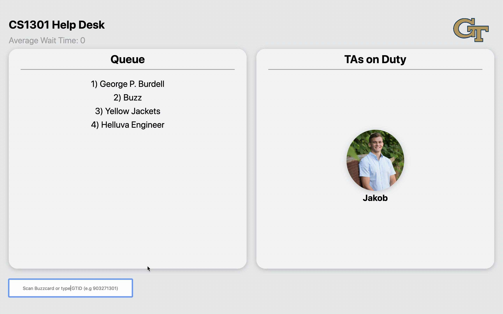
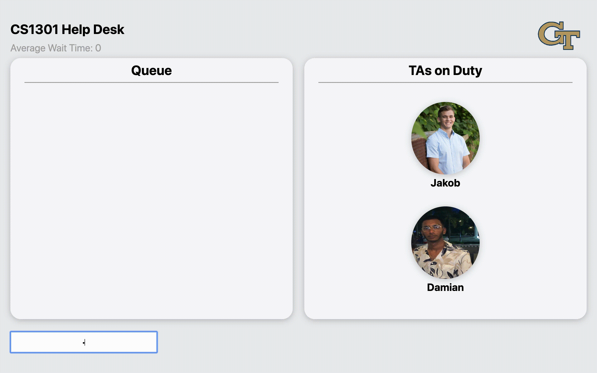

# FyeFo2.0

Origin of 'FyeFo':

    'FIFO' - First-In-First-Out methodology exhibited in the queue abstract data stucture.
    
    'Fye' - Slang expression used to describe someone or something that is excellent or in a state of excitement.
  

'FyeFo' is the online queue for the CS 1301 Help Desk at the Georgia Institute of Technology.

-

Students can join the queue by scanning their Buzzcard or typing in their GTID:

-

TAs can be added similarly.

-

TAs can remove from and clear the queue.

-

TAs can take eachother off duty.

